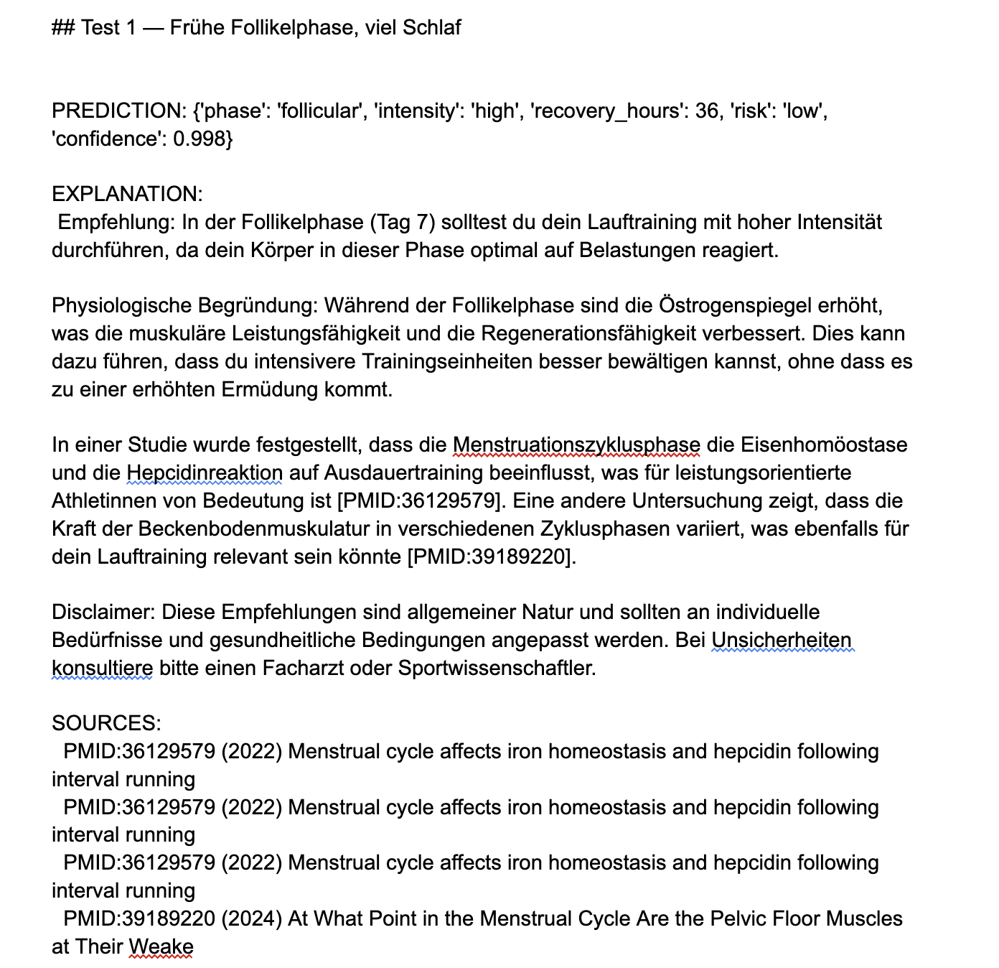
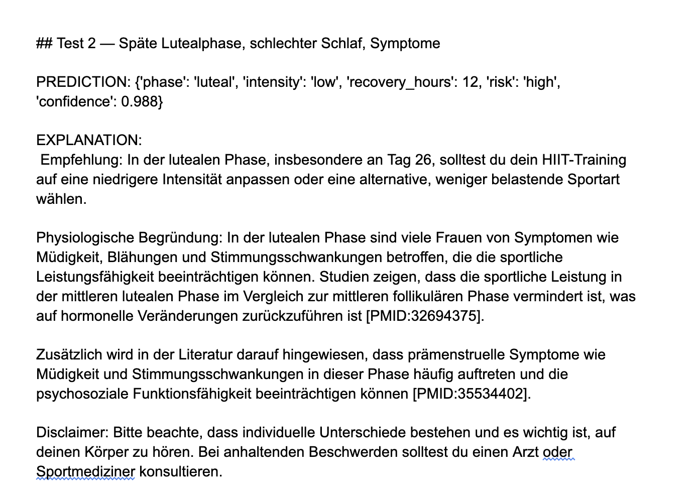
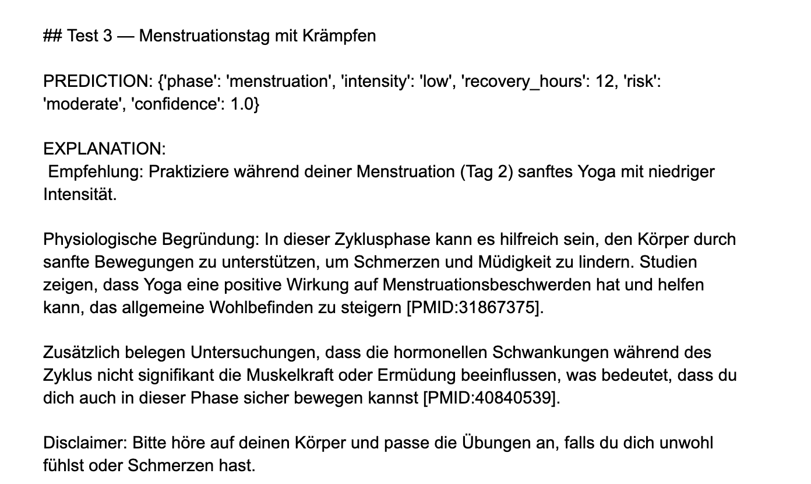

## Project Metadata

- Project title: CycleSync — Cycle-based Training & Recovery Coach
- Student: Claudia Carvalho Paula (Business Informatics, class TZaBIS)
- GitHub repository URL: https://github.com/carvacla/cyclesync_KI_project
- Deployment URL: https://huggingface.co/spaces/CarvalhoClaudia/cyclesync
- Submission date: 07.06.2026

### Mandatory Setup Checks

- [x] At least 2 blocks selected
- [x] Multiple and different data sources used
- [x] Deployment URL provided
- [x] Required GitHub users added to repository (`jasminh`, `bkuehnis`)

## Selected AI Blocks

- [x] ML Numeric Data
- [x] NLP
- [ ] Computer Vision

Primary blocks used for core solution (choose 2):
- Primary block 1: ML Numeric Data
- Primary block 2: NLP (Retrieval-Augmented Generation)

If a third block is selected, it is documented and graded separately as extra work.

Guidance hint: Keep the project idea short and consistent. Focus most details on the selected blocks.
Evidence hint: Show where each selected block contributes to the final system.

---

## 1. Project Foundation (Short)

### 1.1 Problem Definition
- Problem statement: Sports science research and mainstream training apps largely ignore the cyclical physiological changes female athletes experience throughout their menstrual cycle. Recommendations are predominantly based on male study populations, which can lead to suboptimal training and recovery guidance for female users.
- Goal: Build a web application that generates evidence-based training recommendations from cycle and wellness data, and explains them using current scientific literature from PubMed.
- Success criteria:
  1. ML classifier achieves F1 (macro) ≥ 0.75 on the hold-out test set
  2. RAG pipeline returns at least 2 thematically relevant PubMed sources per recommendation
  3. End-to-end response latency < 10s in the deployed app
  4. Publicly accessible deployment on HuggingFace Spaces

### 1.2 Integration Logic
- How the selected blocks interact: The ML block classifies the training recommendation (low/moderate/high) from structured user data (cycle day, symptoms, sleep quality, resting heart rate, etc.). The structured prediction (phase, intensity, recovery hours, risk, confidence) is then passed as context to the RAG pipeline. The RAG retrieves matching PubMed abstracts and a large language model generates a personalized German-language explanation citing the studies.
- Data and output flow between blocks: User input → ML pipeline ([`src/ml_model.py`](../src/ml_model.py)) → structured prediction → RAG pipeline ([`src/rag_pipeline.py`](../src/rag_pipeline.py)) → combined response containing recommendation, explanation, and source list. Orchestrated by [`src/recommender.py`](../src/recommender.py), presented via [`app.py`](../app.py).

Guidance hint: This section should be short. The detailed work belongs in block sections.
Evidence hint: Include one clear pipeline overview.

---

## 2. Block Documentation

Complete only selected blocks. Mark non-selected block sections as N/A.

### 2A. ML Numeric Data (If selected)

#### 2A.1 Data Source(s)
List every usage of a data source as a separate entry. If the same source is used twice for different roles, add it twice.

| Entry | Source name or link | Type | Size | Role in this block |
| --- | --- | --- | --- | --- |
| 1 | Synthetic cycle-tracking dataset, generated in [`notebooks/01_data_acquisition.ipynb`](../notebooks/01_data_acquisition.ipynb) based on published physiological patterns (Schmalenberger et al. 2021, Carmichael et al. 2021) | Numeric/categorical (cycle day, phase, BBT, sleep hours/quality, symptoms, resting HR, age, fitness level) | 500 users × 3 cycles × 28 days = 42'000 daily records | Training and evaluation set for the recommendation classifier |
| 2 | Synthetic workout dataset, generated in Notebook 01 based on the McNulty et al. 2020 meta-analysis | Numeric/categorical (sport, duration, average HR, RPE, recovery hours, weather) | ~10'000 workouts | Validation of phase-dependent performance assumptions, supporting realism for the feature space |
| 3 | — | — | — | — |

#### 2A.2 Preprocessing and Features
- Cleaning steps: Symptom strings (semicolon-separated) are expanded into 6 binary indicator features (`sym_cramps`, `sym_fatigue`, `sym_mood_low`, `sym_headache`, `sym_bloating`, `sym_tender_breasts`). No missing values, as data is synthetic and deterministic. See [`notebooks/02_eda.ipynb`](../notebooks/02_eda.ipynb#4-processed-data-speichern).
- Preprocessing steps: A `ColumnTransformer` applies `StandardScaler` to 13 numeric features and `OneHotEncoder` to 2 categorical features (phase, fitness_level). Stratified 70/15/15 split for train/validation/test, see [`notebooks/03_ml_modeling.ipynb`](../notebooks/03_ml_modeling.ipynb#1-daten-laden-features-definieren).
- Feature engineering and selection: Derived feature `symptom_count` (sum of symptom indicators) and 6 binary symptom flags. Feature importance was analyzed via the Random Forest classifier. The most important predictors are `sleep_quality` (~0.24), `day_in_cycle` (~0.19), `phase_follicular` (~0.11), `symptom_count` (~0.09), and `phase_luteal` (~0.08). See [`docs/screenshots/RandomForestFeatures.png`](screenshots/RandomForestFeatures.png).

#### 2A.3 Model Selection
- Models tested: Logistic Regression (baseline), Random Forest, XGBoost.
- Why these models were chosen: Logistic Regression serves as an interpretable linear baseline. Random Forest is a robust ensemble model well-suited to tabular data with mixed feature types. XGBoost provides a gradient-boosting comparison representing state-of-the-art performance on structured data.

#### 2A.4 Model Comparison and Iterations
| Iteration | Objective | Key changes | Models used | Main metric | Change vs previous |
| --- | --- | --- | --- | --- | --- |
| 1 | Baseline | Default parameters, multinomial logistic regression | Logistic Regression | Val F1 (macro): 0.881, Val Accuracy: 0.898 | — |
| 2 | Ensemble | n_estimators=200, max_depth=15 | Random Forest | Val F1 (macro): 1.000, Val Accuracy: 1.000 | +0.119 F1 |
| 3 | Gradient Boosting | n_estimators=300, max_depth=6, lr=0.1 | XGBoost | Val F1 (macro): 1.000, Val Accuracy: 1.000 | ±0.000 vs Iter 2 |

Visual comparison: [`docs/screenshots/Modell_Vergleich_ValidationSet.png`](screenshots/Modell_Vergleich_ValidationSet.png).

#### 2A.5 Evaluation and Error Analysis
- Metrics used: Accuracy, F1 (macro), Confusion Matrix, Feature Importance. See screenshots [`LogisticRegression.png`](screenshots/LogisticRegression.png), [`RandomForest.png`](screenshots/RandomForest.png), [`XGBoost.png`](screenshots/XGBoost.png).
- Final results: Random Forest on test set: **F1 (macro) = 1.000**, **Accuracy = 1.000**. The confusion matrix shows perfect classification: 3031 low, 1059 moderate, 2210 high, no misclassifications. See [`docs/screenshots/ConfusionMatrix.png`](screenshots/ConfusionMatrix.png).
- Error patterns and likely causes: The perfect scores of Random Forest and XGBoost are methodologically explainable and warrant critical reflection. The target `recommended_intensity` is generated in Notebook 01 by a **deterministic rule function** (`recommend_intensity()`) derived from phase, sleep quality, and symptoms. Tree-based models can reconstruct this rule almost perfectly because their splits naturally align with the threshold values used (e.g. `sleep_quality <= 4`, `symptom_count >= 2`). Logistic Regression, being a linear model, scores only ~88% F1 because it cannot model these discrete thresholds as well. For a production system trained on real, noisy labels this behavior would not be expected — the deterministic label function is a known limitation of the synthetic data foundation.

#### 2A.6 Integration with Other Block(s)
- Inputs received from other block(s): None in the current version — the ML block operates directly on structured user input.
- Outputs provided to other block(s): The structured prediction `{phase, intensity, recovery_hours, risk, confidence}` is passed to the RAG pipeline via the [`CycleSyncRecommender`](../src/recommender.py#L8-L19). Phase and intensity values shape the retrieval query, and all values are injected into the prompt as context.

Guidance hint: Keep entries practical and evidence-based.
Evidence hint: Add values, not only claims.

### 2B. NLP (If selected)

#### 2B.1 Data Source(s)
List every usage of a data source as a separate entry. If the same source is used twice for different roles, add it twice.

| Entry | Source name or link | Type | Size | Role in this block |
| --- | --- | --- | --- | --- |
| 1 | PubMed abstracts via NCBI E-utilities (8 search queries on menstrual cycle / exercise / training topics) | Text (scientific abstracts with title, PMID, year, authors) | ~300 abstracts | Knowledge base for RAG retrieval |
| 2 | Structured ML prediction from Block 2A | JSON-structured | per request | Context in the prompt + drives the retrieval query |
| 3 | User profile from the Streamlit UI ([`app.py`](../app.py)) | Structured (cycle day, symptoms, sleep data, etc.) | per request | Personalizes the explanation |

#### 2B.2 Preprocessing and Prompt Design
- Text preprocessing: Abstracts shorter than 100 characters are filtered out, deduplication by PMID, metadata enrichment (year, authors). No chunking required, as abstracts are inherently short. See [`notebooks/04_rag_pipeline.ipynb`](../notebooks/04_rag_pipeline.ipynb#1-dokumente-vorbereiten).
- Prompt design or retrieval setup: Local embedding model `sentence-transformers/all-MiniLM-L6-v2` (free, runs on CPU). Chroma serves as the vector store, built in-memory at app startup from the persisted JSONL file (avoiding cross-version chromadb format incompatibilities). Top-4 retrieval. The prompt contains the structured user and ML context as well as the retrieved abstracts and asks for a German response in four structured parts: concrete recommendation, physiological reasoning, at least two `[PMID:xxxx]` citations, and a disclaimer. See [`src/rag_pipeline.py`, lines 11-32](../src/rag_pipeline.py#L11-L32).

#### 2B.3 Approach Selection
- Approach used (classical NLP, transformer, RAG, prompt engineering): Retrieval-Augmented Generation (RAG) with GPT-4o-mini as generator and a local Sentence-Transformer as encoder.
- Alternatives considered: (1) Pure prompt engineering without retrieval — rejected due to hallucination risk on medical topics and the lack of citable sources. (2) Classical information retrieval with TF-IDF — rejected because it captures fewer semantic similarities for sports-science terminology.

#### 2B.4 Comparison and Iterations
| Iteration | Objective | Key changes | Model or prompt setup | Main metric or qualitative check | Change vs previous |
| --- | --- | --- | --- | --- | --- |
| 1 | Baseline RAG | MiniLM embeddings, Top-4 retrieval, initial structured prompt | gpt-4o-mini, temp=0.3 | Qualitative review: answers were understandable, but source quality varied | — |
| 2 | Improved structured output | Prompt refined to require recommendation, physiological reasoning, PubMed citations and disclaimer | gpt-4o-mini, temp=0.3 | More consistent answer structure and disclaimer inclusion | Improved clarity and consistency |
| 3 | End-to-end evaluation | Tested complete ML → RAG pipeline on 3 representative user scenarios | Final deployed setup | Checked ML/RAG consistency, citation presence, tone and limitations | Confirmed integration and identified retrieval limitations |

The main iteration was the refinement from a simple RAG prompt to a more structured prompt. The final version explicitly asks for a concrete training recommendation, physiological reasoning, PubMed citations and a medical disclaimer. This improved the consistency and readability of the generated explanations.


#### 2B.5 Evaluation and Error Analysis

- Evaluation strategy: The NLP/RAG component was evaluated qualitatively using three realistic end-to-end test scenarios in [`notebooks/05_integration_test.ipynb`](../notebooks/05_integration_test.ipynb). The evaluation focused on whether the generated explanation is consistent with the ML prediction, whether the recommendation is understandable for the user, whether PubMed citations are included, and whether the medical disclaimer is present. In addition, the quality of retrieved sources was inspected manually.

| Scenario | ML Prediction | RAG Output Quality | Main Issue | Decision |
| --- | --- | --- | --- | --- |
| Test 1: Early follicular phase, good sleep | follicular, high intensity, low risk | Mostly useful and consistent with the ML prediction | Duplicate PMID in the source list and one weakly related source | Keep, but document retrieval limitation |
| Test 2: Late luteal phase, poor sleep, symptoms | luteal, low intensity, high risk | Good and context-aware | Evaluation still based on a small number of scenarios | Keep |
| Test 3: Menstruation day with cramps | menstruation, low intensity, moderate risk | Good, user-friendly and aligned with symptoms | Not a medical diagnosis; must be interpreted as general guidance only | Keep |

**Test 1 — Early follicular phase with good sleep**



In this scenario, the ML model predicted the follicular phase with high training intensity, low risk and high confidence. The generated explanation recommends high-intensity running training, which is consistent with the ML output. The answer includes a physiological explanation, PubMed citations and a disclaimer.

However, this test also shows a limitation of the current retrieval setup: the same PubMed source appears multiple times in the source list. In addition, one retrieved source about pelvic floor muscle strength is only indirectly related to the training recommendation. This indicates that the current Top-k retrieval can return redundant or weakly related sources.

**Test 2 — Late luteal phase with poor sleep and symptoms**



In this scenario, the ML model predicted the luteal phase with low training intensity and high risk. The generated recommendation suggests lowering the training intensity or choosing a less demanding activity. This is consistent with the ML prediction and with the user context, especially because poor sleep and symptoms were present.

The explanation refers to reduced performance and premenstrual symptoms in the luteal phase and includes PubMed citations. The tone is appropriate and the disclaimer is clear. Compared with Test 1, the retrieved sources appear more relevant to the scenario.

**Test 3 — Menstruation day with cramps**



In this scenario, the ML model predicted menstruation with low intensity, moderate risk and full confidence. The generated recommendation suggests gentle yoga, which is appropriate for a menstruation day with cramps and is consistent with the ML output.

The explanation includes a clear recommendation, a physiological explanation, PubMed citations and a disclaimer. The response is user-friendly and avoids presenting the output as medical diagnosis.


**Qualitative evaluation summary**

The three screenshots above document representative end-to-end outputs of the final deployed RAG setup. The focus was not a formal prompt benchmark, but a qualitative check of whether the complete ML → RAG pipeline behaves plausibly for different cycle phases and symptom patterns.

The evaluation shows that the system generally produces explanations that are consistent with the structured ML prediction. It also shows relevant limitations, especially duplicate sources and occasionally weakly related PubMed abstracts.

- Results: Overall, the RAG component generated understandable and context-aware explanations that were aligned with the ML predictions. The strongest outputs were generated when the retrieved PubMed abstracts were directly related to the predicted phase and symptoms.

- Error patterns and likely causes: The main limitation is retrieval quality. In some cases, the same PubMed source appears multiple times, and some retrieved abstracts are only loosely related to the specific recommendation. This is caused by the current Top-k similarity retrieval, which does not enforce source diversity. A future improvement would be to add duplicate filtering, Maximum Marginal Relevance (MMR), stricter source relevance checks and a larger evaluation set.


#### 2B.6 Integration with Other Block(s)
- Inputs received from other block(s): Structured ML prediction `{phase, intensity, recovery_hours, risk, confidence}` from Block 2A — included in the prompt context and used to build the retrieval query (see [`src/rag_pipeline.py`, lines 80-87](../src/rag_pipeline.py#L80-L87)).
- Outputs provided to other block(s): Natural-language explanation plus a list of cited studies (PMID, title, year) returned to the application layer ([`app.py`](../app.py)) for display.

Guidance hint: Show concrete prompt or retrieval decisions.
Evidence hint: Include representative outputs or failure cases.

### 2C. Computer Vision (If selected)

N/A — Computer Vision is not part of this project.

#### 2C.1 Data Source(s)
N/A

#### 2C.2 Preprocessing and Augmentation
N/A

#### 2C.3 Model Selection
N/A

#### 2C.4 Model Comparison and Iterations
N/A

#### 2C.5 Evaluation and Error Analysis
N/A

#### 2C.6 Integration with Other Block(s)
N/A

Guidance hint: Use concise examples from real predictions.
Evidence hint: Include sample outputs and observed failure cases.

---

## 3. Deployment

- Deployment URL: https://huggingface.co/spaces/CarvalhoClaudia/cyclesync
- Main user flow:
  1. User enters cycle day, symptoms, sleep data, resting heart rate, and the planned workout in the sidebar.
  2. The app calls `CycleSyncRecommender.recommend()` ([`src/recommender.py`](../src/recommender.py)).
  3. The ML prediction is displayed in 4 metric tiles (cycle phase, intensity, recovery time, risk).
  4. Below, the LLM-generated explanation appears together with an expandable list of cited sources (PubMed links) and model confidence.
- Screenshot or short demo: See [`docs/screenshots/Anzeige.png`](screenshots/Anzeige.png) and [`docs/screenshots/AnzeigeHF.png`](screenshots/AnzeigeHF.png) for the running app on HuggingFace Spaces.

Guidance hint: Deployment must be usable.
Evidence hint: Add screenshots or short demo references.

---

## 4. Execution Instructions

- Environment setup:
```bash
  git clone https://github.com/carvacla/cyclesync_KI_project.git
  cd cyclesync_KI_project
  python -m venv .venv
  source .venv/bin/activate     # Mac/Linux
  pip install -r requirements.txt
  cp .env.example .env          # set OPENAI_API_KEY
```
- Data setup: Run [`notebooks/01_data_acquisition.ipynb`](../notebooks/01_data_acquisition.ipynb) — generates the synthetic cycle and workout datasets (deterministic via `RANDOM_STATE=42`) and downloads ~300 PubMed abstracts via Biopython (NCBI E-utilities API).
- Training command(s): Execute notebooks 02 → 03 → 04 in order. Outputs: `models/best_classifier.joblib`, `models/feature_meta.json`, `models/chroma_db/` (the vector store is rebuilt at app startup from the JSONL for deployment compatibility).
- Inference/run command(s):
```bash
  streamlit run app.py
```
- Reproducibility notes: All notebooks use `RANDOM_STATE=42`. Library versions are pinned in [`requirements.txt`](../requirements.txt) (notably `scikit-learn==1.6.1` matching the training environment, and `httpx==0.27.2` for OpenAI compatibility on HuggingFace Spaces). Python 3.11 recommended. For HuggingFace Spaces deployment: set `OPENAI_API_KEY` as a Space secret under Settings → Variables and secrets.

Guidance hint: Another person should be able to run your project from this section.
Evidence hint: Include exact commands and versions.

---

## 5. Optional Bonus Evidence

Use this section for exceptional work beyond the core requirements.

- [ ] Third selected block implemented with strong quality
- [x] More than two data sources used with clear added value
- [ ] A core section is done exceptionally well
- [x] Extended evaluation
- [x] Ethics, bias, or fairness analysis
- [x] Creative or exceptional use case

Evidence for selected bonus items:

**More than two data sources** — Three distinct data sources with clear added value: (1) synthetic cycle-tracking dataset for phase and symptom modeling, (2) synthetic workout dataset for performance and recovery assumptions, (3) real PubMed abstracts as scientific knowledge base. This separation allows independent validation of the ML prediction and the natural-language reasoning.

**Extended evaluation** — Beyond the required metrics, a feature-importance analysis was performed showing that `sleep_quality` and `day_in_cycle` are the strongest predictors. The methodological reflection on the perfect tree-model scores (see 2A.5) demonstrates critical self-assessment instead of uncritical metric maximization. The final ML → RAG pipeline was evaluated qualitatively over three representative end-to-end scenarios.

**Ethics, bias, or fairness analysis** — Sports-science research is historically dominated by male participants (McNulty et al. 2020 report that less than 39% of sports-science studies include female participants). Recommendations derived from this literature can therefore be systematically suboptimal for female athletes. CycleSync explicitly addresses this gap. The app includes a visible disclaimer (no medical advice). Privacy: no persistence of user input, all computation runs per request. Limitations of the synthetic data foundation are made transparent in the documentation.

**Creative or exceptional use case** — Combining a cycle-phase-aware training classifier with a RAG pipeline over current PubMed literature in a German-language Streamlit frontend (including medical disclaimers and PubMed source links) addresses a real and underserved domain not commonly covered by mainstream training apps or student projects.
